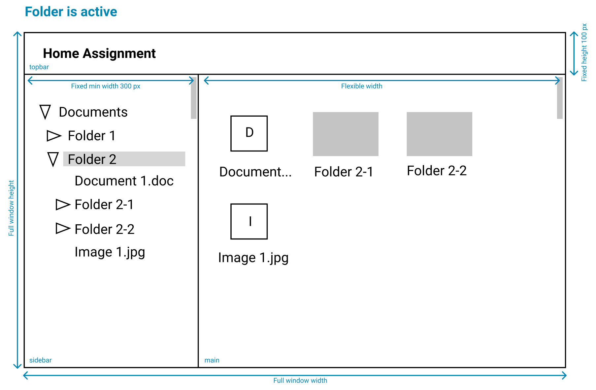
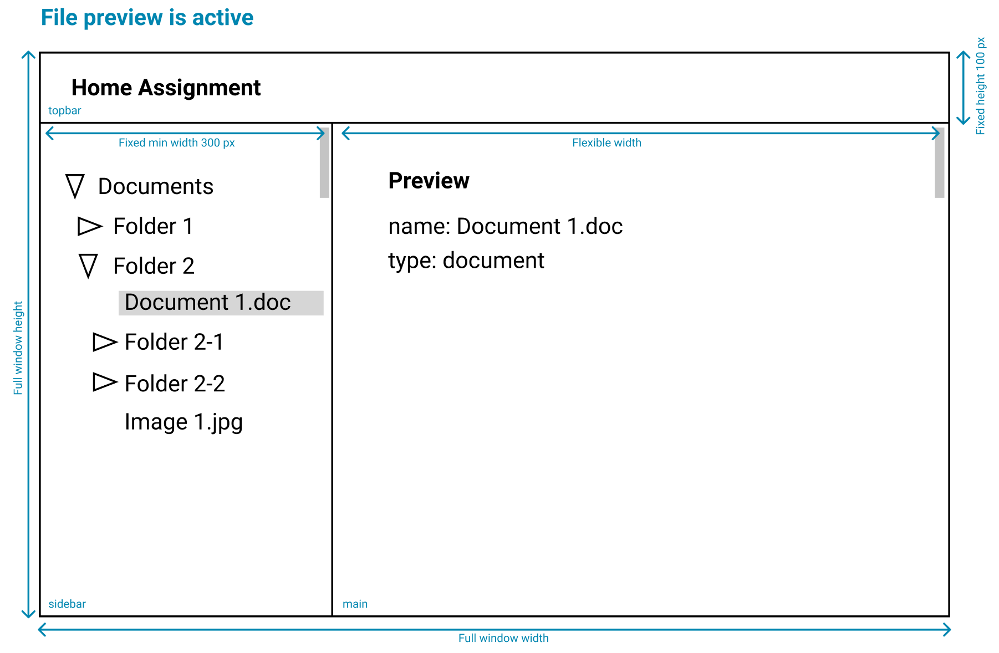

# Corti Frontend Home Assignment

Take all the time that you need to complete the assignment. We expect to see all the user stories fulfilled. Although there is no strict maximum, we do not expect you to spend more than 3-4 hours on this.

## Task - Directory Browser

You have to build the application which displays a file system directory structure similar to the example wireframe provided. Items can only be one of two types - file or folder, which should be visually distinguishable.

**Folder is active**



**File preview is active**



### User story 1 - View tree

As a user I can see the files and folders rendered as a tree structure in the `sidebar`, where contents of the folder are **ordered alphabetically**.

### User story 2 - Expand/collapse

As a user I can click once on a folder in the `sidebar` to expand/collapse it's contents. The same click will also make the folder active. Expanding/collapsing a folder should not result in previously expanded/collapsed folders to change state.

### User story 3 - Activating a file/folder in sidebar

As a user I can click on a folder or file in the `sidebar` to make it active. Currently active file/folder should be displayed in the `main` area.

- Active folder should display it's contents in the `main` area.
- Active file should display it's name and type in the `main` area.

### User story 4 - Activating a file/folder in main area

As a user I can click on a file or folder in the `main` area to activate it. When activated, it should also expand the path to the folder in the `sidebar` tree.

### Non-functional requirements

- We prefer `typescript` but you can write your solution in `javascript` too.

- We do not require tests, but feel free to add it if you see the actual need.

- You can choose to use any third party libraries that you see the need for.

- We don't require the application to be beautifully styled, but we expect you to implement the layout as in the example.

- You only need to make it work on desktop screens, no mobile views required.

- You can use all modern css features (we will test on the newest chrome).

## How to work

We provide a `create-react-app` bootstraped project with `typescript` support (not mandatory to use). You should only need to write your implementation in the `src` directory, but feel free to add any supporting files, tools or configs outside the `src` if you see the need for it.

To run the frontend client:

```
npm start
```

There is an api server provided that will serve the data to your frontend application.

To run the api server locally:

```
npm run server:start
```

Api will be available from your client by requesting this url `/api/v1/tree` (proxy is configured in `package.json`)

```js
fetch('/api/v1/tree');
```

## How we review

- We value quality over feature-completeness. You don’t need to implement more than it’s asked for, instead imagine you were given these requirements by your product manager.

- It is fine to leave things aside provided you call them out in your project's README. The goal of this code sample is to help us understand how you approach a given problem and how you make decisions when writing the implementation. It does not need to be production ready code (all the edge cases or errors handled), but it needs to lay the initial foundation which can be extended further by you or your team. You should consider this code ready for a code review with your colleague.

- Don’t worry about having a super clean git history - some history is better than 1 squashed commit.

## How to submit

- We appreciate if you give us some feedback on this assignment in this README file below. Is the task too difficult/easy? Is it easy to understand what's asked for you to do? Is the scope of the task too big? Any feedback is welcome.

- Upload this project to a public or private github repository. If repo is private, do not forget to invite the list of people that are mentioned in the email you received Alternatively, send the project in a zip file and share by email.

- **IMPORTANT:** Don't forget to add a number of hours it took you to complete it!

## Your notes

- This was an interesting assignment! Looking at it further I realized that only about half of the project was finished unlike we thought. That means I did in fact end up doing most of story 3 and all of story 4 (showing a preview of a document was already done but I had to show the preview of the contents of a folder meaning I still have to create a grid view and the compoinents for showing file contents).

- I also made a few executive decisions but those can also be easily changed - for example I made it so that a folder is only activated when you click it and it's closed. when it's open and you click it again I removed the preview because you are technically closing the content you were selecting so nothing should be shown. To change that all that would have to be done is removing appContext.setSelectedfile(file) to outside the if statement checking if the folder is opened or closed

- The first additional feature I focused on was adding two search bars -- one in the nav bar to give a quick top-level view of the roote folders and documents and one within the preview to find specific files within a folder

- the second additional feature was creating a modal preview feature. Now, if you click a document within the preview screen, it will popup with it's details instead of taking up the whole page

- Timing is a bit difficult for me to tell since I didn't do it in one sitting and most of the technically difficulties/learning curve was learning Material UI since that is what was set up from the applicant who previously began filling this out. If I take out the time from reading the documentation to udnerstand the code already written with Material UI as well as the time taken to think/test possible features, I would say it was probably within 4-5 hours or so. I could probably have shaved this time down a bit if I didn't spend some time really trying to get something things to work closely to how I originally wanted. For example, figuring out a good way to dynamically change the number of rows in a grid view took some time where I could have just left it at a static number. I spent the time on it though becuase I figured more effort is always good!

- I think the difficulty here was reasonable -- it's always good to have a test that is like what the actual work will be. The instructions were also very clear.

- I forgot to do git updates throughout so I just removed all my features and then added them one by one and pushed for your convenience

- Thank you for the test! I enjoyed working on it and I hope to be able to show you more soon!
